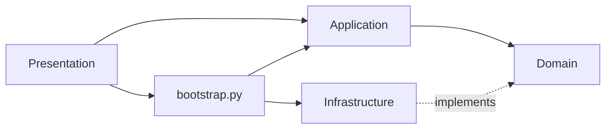

# 🏛️ Reglas de Arquitectura — APA Formatter

> **Este documento es la fuente de verdad arquitectónica del proyecto.**
> Toda IA o desarrollador que modifique código **DEBE** leer `@ARCHITECTURE.md` y seguir estas reglas.
> Para verificar cumplimiento ejecutar el workflow `/check-architecture`.

---

## 1. Capas y Regla de Dependencia

El proyecto sigue **Clean Architecture** con 4 capas. La regla fundamental es:

```
Las dependencias SOLO apuntan hacia adentro (→ Domain).
Nunca al revés.
```



| Capa | Directorio | Puede importar de | NO puede importar de |
|---|---|---|---|
| **Domain** | `domain/` | Solo stdlib y domain | application, infrastructure, presentation, config, adapters |
| **Application** | `application/` | domain | infrastructure, presentation |
| **Infrastructure** | `infrastructure/` | domain, libs externas (python-docx, fpdf2, requests) | application, presentation |
| **Presentation** | `presentation/` | application, domain (modelos/enums), bootstrap | infrastructure (directo) |

### ⚠️ Violaciones prohibidas

```python
# ❌ NUNCA en domain/
from apa_formatter.infrastructure.renderers import DocxRenderer
from apa_formatter.config.loader import load_config
from apa_formatter.adapters.docx_adapter import DocxAdapter

# ❌ NUNCA en application/
from apa_formatter.infrastructure.persistence import JsonReferenceRepository
from apa_formatter.presentation.cli import app

# ❌ NUNCA en presentation/
from apa_formatter.infrastructure.renderers import DocxRenderer  # usar Container
```

---

## 2. Estructura de Directorios

```
src/apa_formatter/
├── domain/                    # Capa 1: Entidades + Puertos
│   ├── models/                # Pydantic models (Document, Reference, Enums)
│   ├── ports/                 # ABCs (interfaces) para toda I/O externa
│   ├── rules/                 # Constantes APA 7 puras (sin I/O)
│   └── errors.py              # Excepciones de dominio
│
├── application/               # Capa 2: Casos de Uso
│   ├── use_cases/             # Orquestadores que usan ports (nunca implementaciones)
│   └── dto/                   # Data Transfer Objects
│
├── infrastructure/            # Capa 3: Implementaciones concretas
│   ├── renderers/             # DocxRenderer, PdfRenderer
│   ├── clipboard/             # SystemClipboard
│   ├── persistence/           # JsonReferenceRepository
│   ├── config/                # JsonConfigProvider
│   ├── checkers/              # DocxComplianceChecker
│   └── fetchers/              # DoiFetcher, IsbnFetcher, UrlFetcher
│
├── presentation/              # Capa 4: UI
│   ├── cli/                   # Typer CLI (app.py + formatters.py)
│   └── gui/                   # PySide6 GUI
│
├── bootstrap.py               # 🔑 Composition Root (Container)
│
├── adapters/                  # ⚠️ LEGACY — no agregar código nuevo aquí
├── cli.py                     # ⚠️ LEGACY — usar presentation/cli/
├── config/                    # Configuración (usada por infrastructure/config)
├── converters/                # Conversores legacy
├── fetchers/                  # Fetchers legacy (envueltos por infrastructure/fetchers)
├── gui/                       # GUI legacy (envuelta por presentation/gui)
├── models/                    # Modelos legacy (re-exportados por domain/models)
├── rules/                     # Reglas legacy (re-exportadas por domain/rules)
└── validators/                # Checker legacy (envuelto por infrastructure/checkers)
```

> [!IMPORTANT]
> Los directorios marcados **LEGACY** existen por compatibilidad. Todo código nuevo
> debe ir en las capas `domain/`, `application/`, `infrastructure/` o `presentation/`.

---

## 3. Puertos (Interfaces)

Cada interacción con el mundo exterior se abstrae en un **Port** (ABC) dentro de `domain/ports/`:

| Port | Archivo | Responsabilidad |
|---|---|---|
| `DocumentRendererPort` | `document_renderer.py` | Generar .docx o .pdf |
| `ReferenceRepositoryPort` | `reference_repository.py` | Guardar/cargar referencias |
| `MetadataFetcherPort` | `metadata_fetcher.py` | Obtener metadata por DOI/ISBN/URL |
| `ClipboardPort` | `clipboard_port.py` | Copiar texto al portapapeles |
| `ComplianceCheckerPort` | `compliance_checker.py` | Verificar cumplimiento APA |
| `ConfigProviderPort` | `config_provider.py` | Obtener configuración |

### Reglas para Ports

1. **Solo ABCs con `@abstractmethod`** — sin lógica de implementación
2. **Sin dependencias externas** — solo tipado de domain models
3. **Nombres descriptivos** — sufijo `Port` obligatorio
4. **Un port por responsabilidad** — Interface Segregation Principle

```python
# ✅ Correcto
from abc import ABC, abstractmethod
from apa_formatter.domain.models.document import APADocument

class DocumentRendererPort(ABC):
    @abstractmethod
    def render(self, document: APADocument, output_path: Path) -> Path: ...
```

---

## 4. Casos de Uso

Cada operación del usuario es un **Use Case** en `application/use_cases/`:

| Use Case | Propósito |
|---|---|
| `CreateDocumentUseCase` | Renderizar un documento APA |
| `GenerateDemoUseCase` | Construir documento demo |
| `CheckComplianceUseCase` | Verificar cumplimiento APA 7 |
| `CopyReferenceUseCase` | Copiar referencia al clipboard |
| `ConvertDocumentUseCase` | Convertir .docx → .pdf |
| `FetchMetadataUseCase` | Obtener metadata de APIs |
| `ManageReferencesUseCase` | CRUD de referencias |

### Reglas para Use Cases

1. **Reciben ports por constructor** (Dependency Injection)
2. **Método principal: `execute()`** — nombre consistente
3. **No importan clases concretas** — solo ports y domain models
4. **Sin lógica de presentación** — no Rich, no Qt, no print()

```python
# ✅ Correcto
class CreateDocumentUseCase:
    def __init__(self, renderer: DocumentRendererPort):
        self._renderer = renderer

    def execute(self, doc: APADocument, output: Path) -> Path:
        return self._renderer.render(doc, output)
```

---

## 5. Composition Root (`bootstrap.py`)

El `Container` es el **ÚNICO** lugar donde se importan clases concretas de infrastructure:

```python
from apa_formatter.bootstrap import Container

container = Container()
uc = container.create_document(OutputFormat.DOCX)
result = uc.execute(doc, Path("output.docx"))
```

### Reglas del Container

1. **Es el ÚNICO archivo que importa de `infrastructure/`**
2. **Provee factory methods** para cada Use Case
3. **Inyecta las implementaciones** de cada port
4. **Acepta `config_path`** opcional para perfiles custom

---

## 6. Reglas para Agregar Funcionalidad Nueva

### Nuevo output (ej: HTML renderer)

1. Crear `infrastructure/renderers/html_renderer.py` implementando `DocumentRendererPort`
2. Registrar en `bootstrap.py` → `Container`
3. Agregar `OutputFormat.HTML` al enum en `domain/models/enums.py`
4. **No tocar** domain ni application

### Nuevo caso de uso

1. Crear `application/use_cases/my_use_case.py`
2. Si necesita I/O nueva → crear port en `domain/ports/`
3. Implementar port en `infrastructure/`
4. Registrar factory en `bootstrap.py`
5. Llamar desde `presentation/cli/app.py` o GUI

### Nuevo modelo de datos

1. Agregar en `domain/models/`
2. Si es un enum → `domain/models/enums.py`
3. **Sin imports de infrastructure** en los modelos

### Nuevo comando CLI

1. Agregar `@app.command()` en `presentation/cli/app.py`
2. Delegar a Use Case via `Container`
3. Formateo visual en `presentation/cli/formatters.py`

---

## 7. Testing

```bash
# Ejecutar todos los tests
python -m pytest tests/ -x -q

# Verificar regla de dependencia (debe estar vacío)
grep -rn "from apa_formatter\.\(infrastructure\|presentation\)" src/apa_formatter/domain/
grep -rn "from apa_formatter\.\(infrastructure\|presentation\)" src/apa_formatter/application/
```

### Reglas de testing

1. **Domain tests**: sin mocks — modelos puros y reglas
2. **Application tests**: mockear ports con `unittest.mock`
3. **Infrastructure tests**: pueden usar filesystem real, pero aislado (tmp_path)
4. **No romper tests existentes** — los 286 tests deben pasar siempre

---

## 8. Checklist Pre-Commit

Antes de enviar cualquier cambio, verificar:

- [ ] ¿Mi código nuevo está en la capa correcta?
- [ ] ¿Domain no importa nada de infrastructure/presentation?
- [ ] ¿Application no importa nada de infrastructure/presentation?
- [ ] ¿Usé un port (ABC) en lugar de una clase concreta en application/?
- [ ] ¿Las implementaciones concretas están registradas en `bootstrap.py`?
- [ ] ¿Todos los 286+ tests pasan?
- [ ] ¿El comando `grep` de dependencia da resultado vacío?
