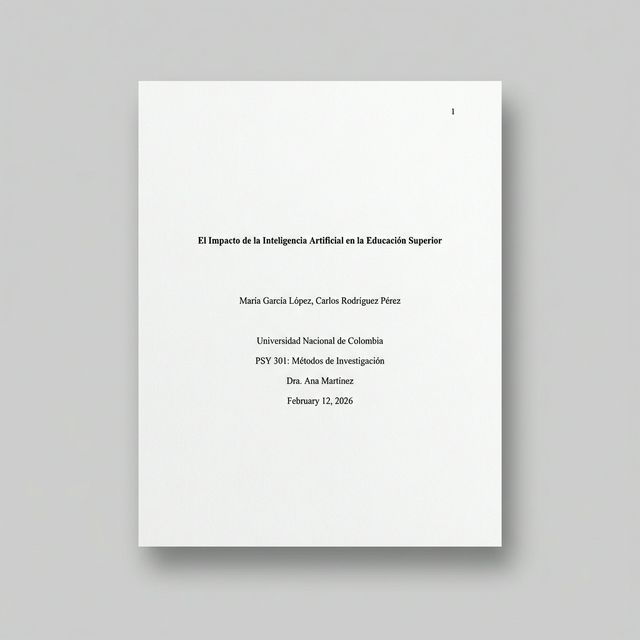
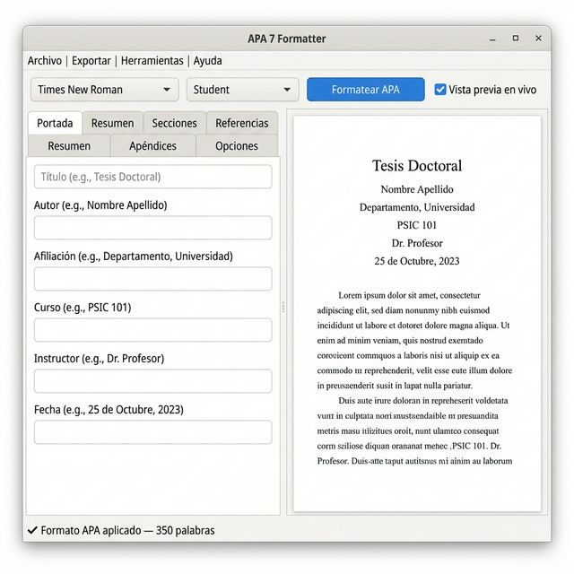

# APA Formatter (APA 7)

**Generador y validador de documentos académicos (Word y PDF) conforme a las normas APA 7ª Edición.**

Este proyecto ofrece una herramienta CLI, una interfaz gráfica (GUI) y una librería Python para crear, convertir y validar documentos siguiendo estrictamente el manual de publicaciones de la American Psychological Association (APA), séptima edición (2020). Incluye soporte para variantes estudiantiles y profesionales, así como perfiles de configuración personalizados (e.g., SENA).

<p align="center">
  
</p>
<p align="center"><em>Ejemplo de portada APA 7 generada automáticamente</em></p>

## Características

- ✅ **Márgenes y Papel**: Márgenes de 1 pulgada (2.54 cm), tamaño Carta.
- ✅ **Tipografía**: Soporta todas las fuentes recomendadas (Times New Roman 12, Calibri 11, Arial 11, etc.).
- ✅ **Encabezados**: Implementa los 5 niveles de jerarquía de títulos APA.
- ✅ **Portada**: Generación automática de portada para Estudiantes (con curso/instructor) y Profesionales (con running head/nota de autor).
- ✅ **Citas y Referencias**: Formateo automático de referencias con sangría francesa (0.5 in) y orden alfabético.
- ✅ **Tablas y Figuras**: Estilos de borde y numeración (negrita/cursiva) según norma.
- ✅ **Validación**: Verifica documentos existentes (.docx) y genera reportes de cumplimiento.
- ✅ **Configurable**: Sistema de configuración JSON extensible (incluye perfil SENA).
- ✅ **Formatos**: Salida nativa en Word (.docx) y conversión a PDF.
- ✅ **Interfaz Gráfica**: GUI completa (PySide6/Qt6) con editor visual, vista previa en vivo y exportación directa.

## Instalación

Requiere Python 3.10 o superior.

```bash
# Instalación en modo desarrollo (recomendado si descargas el código fuente)
pip install -e .

# O instalación directa desde el directorio
pip install .
```

Si deseas instalar también las dependencias de desarrollo (tests, linter):
```bash
pip install -e ".[dev]"
```

## Uso de la CLI

El comando principal es `apa`. Puedes ver la ayuda general con:
```bash
apa --help
```

<p align="center">
  
</p>
<p align="center"><em>Ejemplo de salida de la CLI: creación y verificación de documentos</em></p>

### 1. Crear Documentos (`apa create`)
Genera un nuevo documento desde cero con la estructura básica.

```bash
# Crear un paper básico de estudiante (por defecto)
apa create --title "Impacto de la IA en la Educación" --author "Ana Pérez"

# Especificar detalles académicos y nombre de archivo
apa create \
  --title "Análisis de Redes Neuronales" \
  --author "Carlos Gómez" \
  --affiliation "Universidad Nacional" \
  --course "CS101: Introducción a la IA" \
  --instructor "Dr. Alan Turing" \
  --output "paper_final.docx"

# Crear versión profesional (con running head)
apa create \
  --title "Estudio Longitudinal de Ansiedad" \
  --author "María López" \
  --variant professional \
  --output estudio_profesional.pdf
```

### 2. Generar Demo (`apa demo`)
Crea un documento de ejemplo completo que sirve como plantilla de referencia. Incluye resumen, palabras clave, múltiples niveles de títulos, citas, referencias y apéndices.

```bash
apa demo --output "ejemplo_apa7.docx"

# Usar un perfil de configuración personalizado
apa demo --config src/apa_formatter/config/sena_default.json --output demo_sena.docx
```

### 3. Verificar Cumplimiento (`apa check`)
Analiza un archivo `.docx` existente y verifica si cumple con las reglas de formato APA 7 (márgenes, fuentes, espaciado, encabezados).

```bash
apa check mi_tesis.docx
```
*Salida:* Genera un reporte detallado en la terminal con puntuación de cumplimiento y lista de errores encontrados.

### 4. Conversión (`apa convert`)
Convierte un archivo Word (.docx) a PDF, asegurando que se mantenga el formato.

```bash
apa convert documento.docx --output documento.pdf
```

### 5. Configuración (`apa config`)
Gestiona la configuración del formateador.

```bash
# Ver la configuración actual (JSON)
apa config show

# Validar un archivo de configuración externo
apa config validate mi_config.json

# Inicializar un archivo de configuración personal local
apa config init --output proyecto_config.json
```

### 6. Información de Reglas (`apa info`)
Muestra un resumen de todas las reglas APA 7 implementadas (márgenes, fuentes, niveles de encabezado).

```bash
apa info
```

## Configuración Avanzada

El sistema permite personalizar todas las reglas (márgenes, fuentes, textos predeterminados, localización) mediante archivos JSON.

### Perfil SENA
El proyecto incluye un perfil de configuración adaptado para el **SENA (Servicio Nacional de Aprendizaje)**, que incluye reglas específicas para referencias legales colombianas (basado en Bluebook) y ajustes de márgenes para empaste.

Para usar este perfil:
```bash
apa create --config src/apa_formatter/config/sena_default.json ...
```

O puedes copiarlo y modificarlo:
```bash
cp src/apa_formatter/config/sena_default.json mi_config_sena.json
vim mi_config_sena.json
```

## Interfaz Gráfica (GUI)

Además de la CLI, el proyecto incluye una **interfaz gráfica completa** construida con PySide6 (Qt 6).

<p align="center">
  
</p>
<p align="center"><em>GUI: editor con formulario estructurado y vista previa APA en tiempo real</em></p>

### Lanzar la GUI

```bash
# Usando el comando registrado (tras pip install -e .)
apa-gui

# O directamente con Python
python -m apa_formatter.gui.app
```

### Layout de la Ventana

```
┌────────────────────────────────────────────────────────────┐
│  Menú    (Archivo │ Exportar │ Herramientas │ Ayuda)       │
│  Toolbar [Fuente ▾] [Variante ▾] [📄 Formatear APA]       │
├───────────────────────┬────────────────────────────────────┤
│  Formulario           │   Vista Previa APA                 │
│  (Tabs: Portada,      │   (renderizado en tiempo real)     │
│   Resumen, Secciones, │                                    │
│   Referencias,        │                                    │
│   Apéndices, Opciones)│                                    │
├───────────────────────┴────────────────────────────────────┤
│  Barra de estado                                           │
└────────────────────────────────────────────────────────────┘
```

### Funcionalidades de la GUI

| Función | Descripción |
|---|---|
| **Editor con pestañas** | Formulario estructurado por secciones (Portada, Resumen, Secciones, Referencias, Apéndices, Opciones). |
| **Vista previa en vivo** | Renderizado APA automático con debounce de 600 ms mientras editas. |
| **Selector de fuente/variante** | Cambia entre fuentes APA (Times New Roman, Calibri, Arial) y variantes (Estudiante/Profesional) desde la barra de herramientas. |
| **Exportar a Word/PDF** | Genera archivos `.docx` o `.pdf` directamente desde el menú Exportar. |
| **Importar .docx** | Carga un documento Word existente en el editor para editarlo y re-formatearlo. |
| **Verificador APA** | Abre un diálogo para analizar el cumplimiento APA 7 de cualquier `.docx`. |
| **Gestión de configuración** | Panel visual para ver y editar la configuración JSON activa. |
| **Info y Demo** | Panel con las reglas APA implementadas y generación de documentos de ejemplo. |
| **Gestión de referencias** | Diálogo dedicado para agregar, editar y ordenar referencias bibliográficas. |

### Atajos de Teclado

| Atajo | Acción |
|---|---|
| `Ctrl+Enter` | Formatear documento |
| `Ctrl+N` | Nuevo documento |
| `Ctrl+I` | Importar .docx |
| `Ctrl+Shift+W` | Exportar a Word |
| `Ctrl+Shift+P` | Exportar a PDF |
| `Ctrl+Shift+C` | Verificar APA |

## Uso como Librería

Puedes integrar el formateador en tus scripts de Python:

```python
from datetime import date
from apa_formatter.models.document import APADocument, TitlePage, Section, Reference
from apa_formatter.adapters.docx_adapter import DocxAdapter

# 1. Definir la metadata
doc = APADocument(
    title_page=TitlePage(
        title="Mi Investigación Automatizada",
        authors=["Tu Nombre"],
        affiliation="Tu Universidad",
        due_date=date.today()
    ),
    include_toc=True,  # Generar Tabla de Contenido (feature avanzada)
    sections=[
        Section(
            heading="Introducción",
            content="El contenido de tu introducción..."
        )
    ]
)

# 2. Generar el archivo
adapter = DocxAdapter(doc)
adapter.generate("mi_paper.docx")
```

## Estructura del Proyecto

- `src/apa_formatter/`: Código fuente principal.
  - `models/`: Definiciones de datos (Documento, Referencia, Enums).
  - `adapters/`: Generadores de archivos (Docx, PDF).
  - `config/`: Archivos y lógica de configuración (incluye `sena_default.json`).
  - `validators/`: Lógica de verificación y reglas de cumplimiento.
  - `rules/`: Constantes de formato APA 7 (márgenes, fuentes, estilos).
  - `citations/`: Lógica de citas in-text.
  - `converters/`: Conversión entre formatos.
  - `gui/`: Interfaz gráfica PySide6 (editor, preview, herramientas).
- `tests/`: Pruebas automatizadas (117 tests).

## Licencia

Este proyecto está licenciado bajo la Licencia Pública General de GNU v3.0 (GPLv3). Consulte el archivo [LICENSE](LICENSE) para más detalles.
